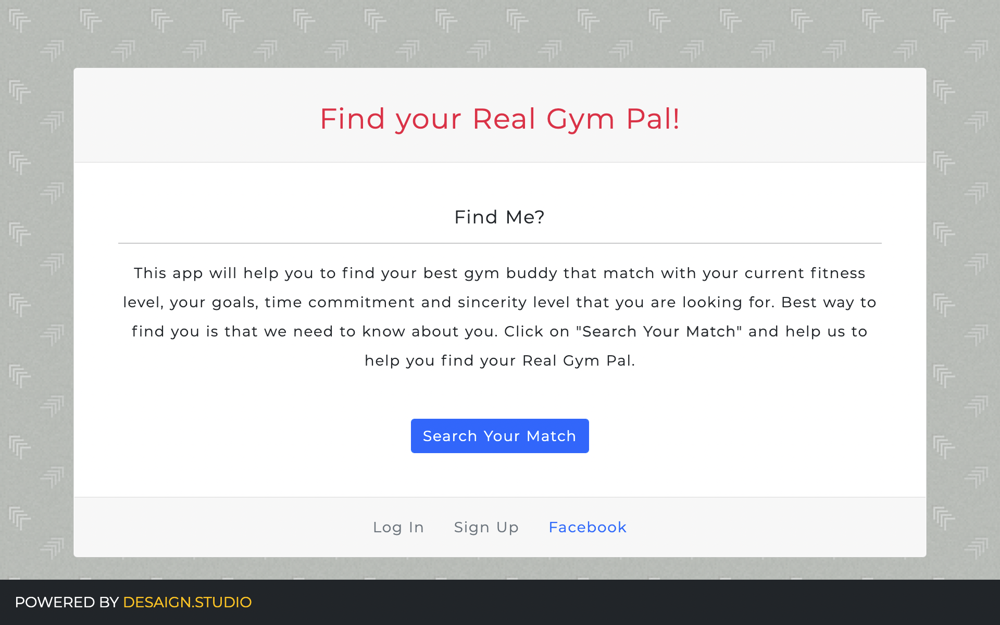

# Real Gym Pal by Desaign Studio

This full-stack site will take in results from your users' surveys, then compare their answers with those from other users. The app will then display the name, Facebook ID and phone number of the user with the best overall match.



- Provide your information like a name you want to call, Facebook ID and phone number before you start
- Answer each question according to your convenience and goals
- Review before submit
- wait a few seconds to get your best match

### Getting Started

- Run 
    - ```npm install```
    - ```npm start```

- Deployment
    - App running on [Heroku](real-gym-pal.herokuapp.com)

### Version

- **2103251042**
✔ Last Update @done (March 25th 2021, 10:42)

### Framework

- HTML5, CSS3, JavaScript

### Built With

- Node JS, Express JS, JQuery, Bootstrap, Google Fonts, SVG

### Software

- Visual Studio Code Editor
- Github for versioning

### Credits

- https://stackoverflow.com/questions/2757973/can-i-ignore-some-website-element-when-navigating-using-the-tab-key

### CONTRIBUTE

- A [contributing guideline](https://github.com/kratuvwxyz/CONTRIBUTE) available.

### LICENSE

- [MIT](https://github.com/kratuvwxyz/LICENSE) © 2021 Kratu Desai, DESAIGN LLC.

## CONTACT

Thank you for your time and consideration. My mantra is simple, *chase perfection to catch excellence*. I hope you enjoy my work. **I'd love to hear from you.** Please email me at <a href="mailto:github@desaign.studio?Subject=Message from Github">github@desaign.studio</a>.

<hr/>

 &copy; 2011-2021. <a href="https://desaign.app" target="_blank" style="text-decoration:none;">DESAIGN STUDIO</a>. All Rights Reseverd. &#160;
<a href="https://www.facebook.com/desaignstudio" target="_blank" style="text-decoration:none;"></a> &#160;
<a href="https://www.twitter.com/desaignstudio" target="_blank" style="text-decoration:none;"></a> &#160;
<a href="https://www.linkedin.com/company/desaignstudio" target="_blank" style="text-decoration:none;"></a> &#160;
<a href="https://desaigner.info" target="_blank" style="text-decoration:none;"></a> &#160;
